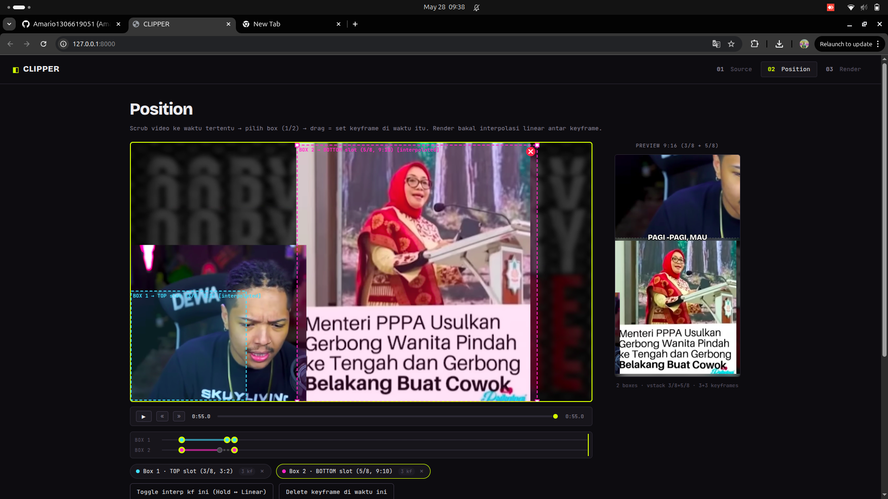
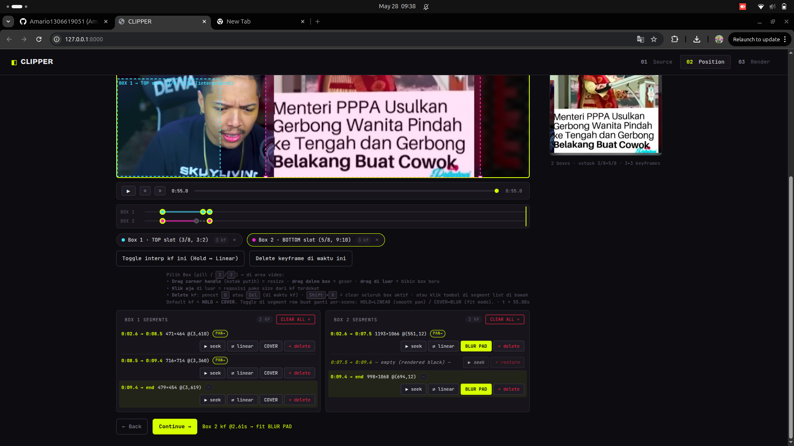

# CLIPPER

A tool for turning YouTube videos into vertical 9:16 clips (TikTok / Shorts / Reels).

Input a URL + time range → draw 2 crop boxes on the source video → auto-transcribe with Whisper → render a final 1080×1920 clip with word-by-word TikTok-style captions.

## UI Preview

**Position step — draw/keyframe two crop boxes, live 9:16 preview on the right:**



**Per-box segment list — each keyframe segment shows time range, size, interp (HOLD/PAN), and fit (COVER/BLUR PAD), plus per-segment toggles:**



## Output layout (locked)

```
┌─────────────────┐  y=0
│   BOX 1 (top)   │  1080×720   (3:2)
├─────────────────┤  y=720      ← caption (when both boxes)
│                 │
│  BOX 2 (bottom) │  1080×1200  (9:10)
│                 │
└─────────────────┘  y=1920
```

Using only 1 box? That box fills the full 1080×1920 frame, with the caption centered (y=960).

**Per-segment layout switching**: if a box has a *gap* segment (trimmed out in the middle), the layout reverts to single-box mode for that stretch — the still-active box fills the full frame instead of leaving a black slot. The caption repositions to match. This mirrors exactly what the Step 2 preview shows.

## Setup

Required on PATH:
- `ffmpeg`, `ffprobe`
- `node` (or `deno`/`bun`) — to solve YouTube's n-challenge
- Chrome / Firefox / Brave / Edge — if you're logged into YouTube in one of them, its cookies are used automatically

```bash
# from the parent folder (sibling of clipper/)
python3 -m venv venv
source venv/bin/activate            # Windows: venv\Scripts\activate
pip install -r clipper/requirements.txt
```

The first `transcribe` will download the Whisper model (~150 MB for `base`).

### YouTube anti-bot fix

YouTube often triggers an anti-bot check. The auto-bypass uses cookies from your browser (detection order: firefox → chrome → chromium → brave → edge).

If detection is wrong / you want to force a specific browser:
```bash
CLIPPER_COOKIES_BROWSER=chrome python main.py
```

If browser cookies don't work (e.g. on a headless server), export cookies manually with a browser extension (e.g. "Get cookies.txt LOCALLY"), save as `clipper/cookies.txt` (Netscape format). That file is auto-detected and takes priority.

## Run

```bash
source venv/bin/activate
cd clipper/backend
python main.py
# → http://127.0.0.1:8000
```

Open the browser and follow the 3 steps: Source → Position → Render.

## GPU acceleration

The encode/decode path auto-detects NVIDIA hardware:

- **NVENC** (`h264_nvenc`) for encoding and **NVDEC** (`-hwaccel cuda`) for decoding are used automatically when a working NVIDIA GPU is present; otherwise it falls back to CPU `libx264`.
- The filter graph itself (per-frame crop, blur) still runs on CPU — those filters have no stock CUDA equivalents — but `-filter_threads`/`-filter_complex_threads` parallelize it.
- Force CPU encoding with `CLIPPER_ENCODER=libx264 python main.py`.

> Note: Whisper transcription runs on CPU unless your PyTorch build matches your CUDA driver.

## Render sub-range

In Step 3 you can set a **Render range (seconds)** to trim the already-downloaded clip further without re-downloading — pick a start/end (or grab the current scrubber time). Keyframes and captions are re-based onto the new range automatically. Leave it blank to render the full clip.

## File map

```
clipper/
├── backend/
│   ├── main.py          FastAPI app + routes + static mount
│   ├── downloader.py    yt-dlp + ffmpeg trim
│   ├── transcriber.py   Whisper wrapper (lru_cache)
│   ├── renderer.py      ffmpeg filter_complex compose
│   └── models.py        Pydantic schemas
├── frontend/
│   ├── index.html       3 panels
│   ├── style.css        dark theme
│   └── app.js           canvas + drag + API
├── temp/                source clips (auto-deleted after render)
├── output/              final mp4s (kept)
└── config.json          batch stub (not wired yet)
```

## Notes

- Whisper defaults to `base` — fast on CPU, decent for English, mediocre for Indonesian. Switch to `small`/`medium` in `backend/transcriber.py` if needed.
- No state persistence. Restarting the server loses jobs. `temp/` survives but the frontend forgets the `job_id`. Single-user local tool, by design.
- Captions use ASS subtitles, burned in via ffmpeg. Fonts are pulled from the OS — install the font locally for custom ones.
- Vanilla JS, no build step. Edit `frontend/*` → refresh the browser.

See `CLAUDE.md` in the repo root for the full spec & roadmap.
